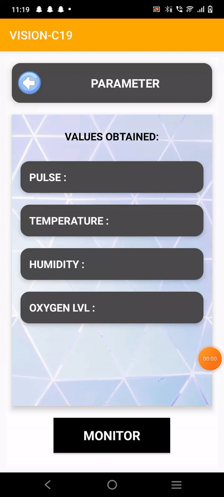
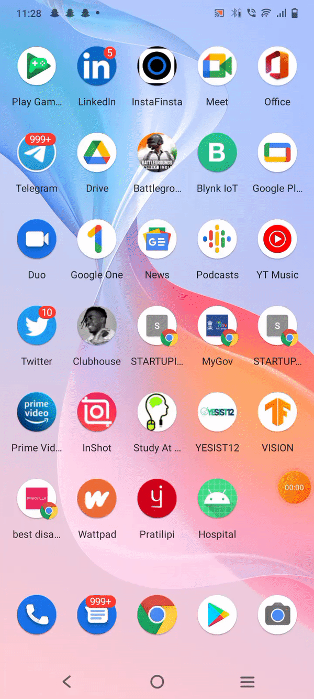

# TRINIT_VISION_ML01
TEAM_VISION_ML01

Introduction:
During this pandemic, the healthcare industry has developed rapidly to combat covid in the best way possible. Many queries and problems have arrived during this pandemic. How can a person know his report is diagnosed well? How can people get to know their Covid queries instantly? and many more.
Proposed Solution:
Our proposed solution was a mobile application integrated with IoT.
Our solution consists of various modules like,
## •	Chatbot (for queries regarding Covid 19)
## •	Scanner (for scanning X-ray and CT images)
## •	Near-by (for nearby vaccine centers)
## •	Checkup (for monitoring parameters)
Work Done:
1.	Chatbot – We have used Dialogflow for creating Chatbot Intents and it is integrated with RapidAPI for retriving on Covid Statistical datas, it can also provide government schemes , live news related to covid , Map wise statistics and alos country specific and also integrated with videos and pictures ,there by can solve any query regards covid19.

2.	Scanner : Here if a person shows the Xray report , he can able to diagnose whether positive or negative. This made by AI feature at the backend. Here these image will be processed using Deep Learning Model ,which is trained with Teachable Machine and converted into Tensorflow Lite format and then this tflite file is integrated with the Application at the backend.

3.	NearBy : MapSDK is integrated to show the nearby vaccine spots with marker ,once the marker is activated it directs to navigation with Google Map.

4.	CheckUp : Here comes the IOT part ,the sensor like temperature ,..etc. is connected to a microcontroller (NodeMCU) .These data will be sent into Firebase and the values will be retrieved and displayed into the mobile application

We have completed all the above-mentioned Modules
Result: Also, we have attached the drive link for Demo Video and Module Video
## [Demos Link !](https://drive.google.com/drive/folders/1PtkP9kQWbQTNlhNtmSNO4QzZ7TZ331mt?usp=sharing)
Conclusion:
Here by our solution the problem statement could be solved

